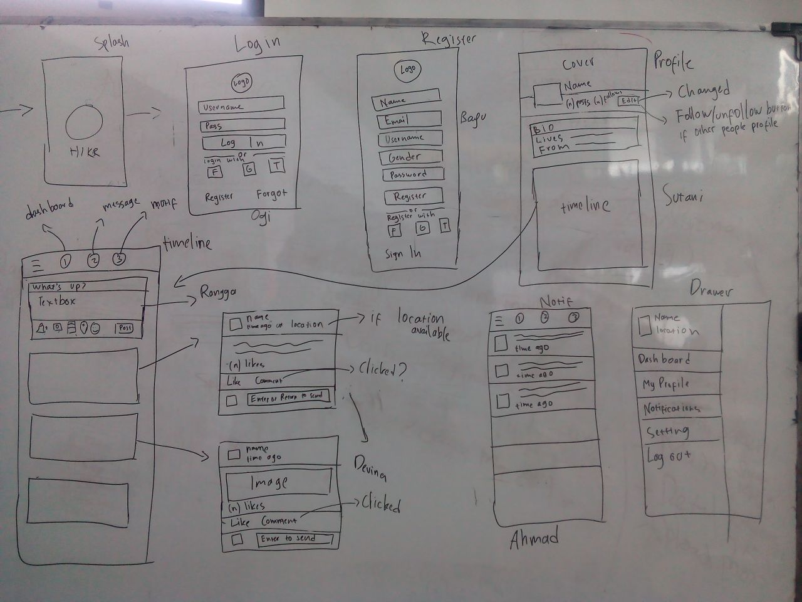

# Hiekr Project

Project goals:
Create a flexible and re-usable mobile application to accompany the RBCodebase.

# Features
The following features are included in the RBCodebase-mobile platform:

## Global Interface
:black_large_square: Allow swiping in all directions but show a light pushback if the direction does not exist.
:black_large_square: Default to english if no language is detected.

## Authentication / On-Boarding
The first phase of the deliverable will be to complete the on-boarding & authentication.  Sign off will include the following features:

### Splash Screen

**Documentation Needed:**
:black_large_square: Document image size for background and logo

**Requirements:**
:black_large_square: Display background image and logo on splash screen

### Walkthrough
Let's keep this flexible, store the walkthrough screens as a configuration array [screenshot, title, text].

	'screen' => [
		'image' => 'some-image1.png'
		'en' => [
			'title' => 'Some Feature one',
			'text' => 'Descriptive text one',
		],
		'de' => [
			'title' => 'Einige Feature eins',
			'text' => 'Beschreibender eins',
		],
	],
	'screen' => [
		'image' => 'some-image2.png'
		'en' => [
			'title' => 'Some Feature two',
			'text' => 'Descriptive text two',
		],
		'de' => [
			'title' => 'Einige Feature zwei',
			'text' => 'Beschreibender zwei',
		],
	],
	'screen' => [
		'image' => 'some-image3.png'
		'en' => [
			'title' => 'Some Feature three',
			'text' => 'Descriptive text three',
		],
		'de' => [
			'title' => 'Einige Feature drei',
			'text' => 'Beschreibender drei',
		],
	],

Have the app read the array generate screen for each so that it is easy to add/edit  walkthrough screens.

**Documentation Needed:**
:black_large_square: Document screenshot size requirements for walkthrough example
:black_large_square: Document where to edit the walkthrough array

**Requirements:**
:black_large_square: Create a screen for each item in documentation array
:black_large_square: Show the Image, Title and Text in the screen
:black_large_square: Show solid navigation circle for each screen in the array
:black_large_square: If current screen is active change icon to hollow circle
:black_large_square: Allow navigation between walkthrough screens by swiping left/right
:black_large_square: When user clicks on "Get Started" takes them to

**Translation:**
:black_large_square: "Get Started"

### Login Screen
Create an intuitive screen to log in via SSO or email.  Expect that new users will use this screen to also register as via SSO.  Ideally this includes a configurable file that allows the disabling or enabling of different supported SSO providers.

**Documentation Needed:**

**Requirements:**
:black_large_square: Sign in via SSO with Facebook
:black_large_square: Sign in via SSO with Twitter
:black_large_square: Sign in via SSO with Google
:black_large_square: Sign in via Email
:black_large_square: Validation: Prompt if Email or Password are incorrect
:black_large_square: Forgot your password lookup by email
:black_large_square: Display TOS/Privacy Policy Statement with App name

**Translation:**
:black_large_square: "Create Account"
:black_large_square: "Sign in with :provider"
:black_large_square: "By signing up, you agree to :App [Terms of Use] and [Privacy Policy]"
:black_large_square: "Sign In"
:black_large_square: "Email"
:black_large_square: "Password"
:black_large_square: "Forgot Your Password"
:black_large_square: "Password Reset"
:black_large_square: "Request Password Reset"

### Registration Screen
Create an intuitive interface to register via SSO or email.  Ideally this includes a configurable file that allows the disabling or enabling of different supported SSO providers.  After returning from registering with an SSO provider (e.g. Facebook) prompt to complete registration by entering in an email address (only if not provided by provider) and setting the password along with any custom fields.  Custom fields are indicated via "data_users_roles.show_on_registration".

**Documentation Needed:**

**Requirements:**
:black_large_square: Register via SSO with Facebook
:black_large_square: Register via SSO with Twitter
:black_large_square: Register via SSO with Google
:black_large_square: Register via Email
:black_large_square: Validation: Prompt if data missing for required fields [name_first, name_last, name_slug, email, password, custom: "data_users_roles.required"]
:black_large_square: Validation: Prompt if Email does not have @ & . or is taken
:black_large_square: Validation: Prompt if Password does not contain minimum characters
:black_large_square: Validation: Prompt if Username is less than 4 characters or is taken
:black_large_square: Display TOS/Privacy Policy Statement with App name

**Translation:**
:black_large_square: "Create Account"
:black_large_square: "Sign in with :provider"
:black_large_square: "By signing up, you agree to :App [Terms of Use] and [Privacy Policy]"
:black_large_square: "Sign In"
:black_large_square: "Email"
:black_large_square: "Password"
:black_large_square: "Forgot Your Password"
:black_large_square: "Password Reset"
:black_large_square: "Request Password Reset"

# Temporary

## Overview of Project and Development Team

Project workflow and development team can be seen in these pictures:

### Page 2

